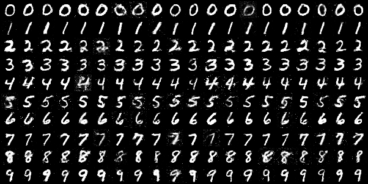

# CN-GAN
CN-GAN first uses the condition only (such as label) to generate conditional noise and then take the conditional noise as the input of the generator to train the model. Conditional noise is generated by autoencoder in CG-GAN. Experimental results on MNIST dataset indicate that images generated by conditional noise meet the demand of quality and diversity.
## Usage
If you want to generate images, then just run `python gen.py`, the generated image is stored as `./fimg.png`.   
If you want to train the model, then just run `python train.py`.
## Example

